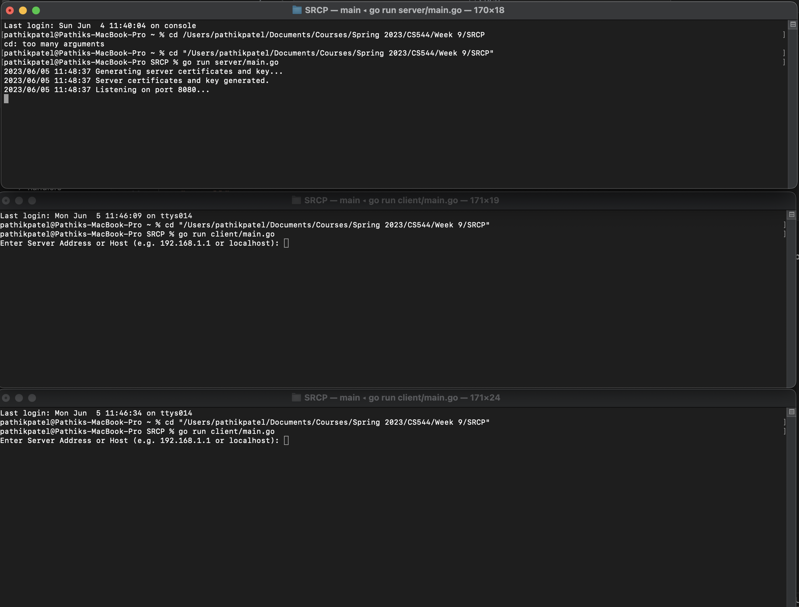
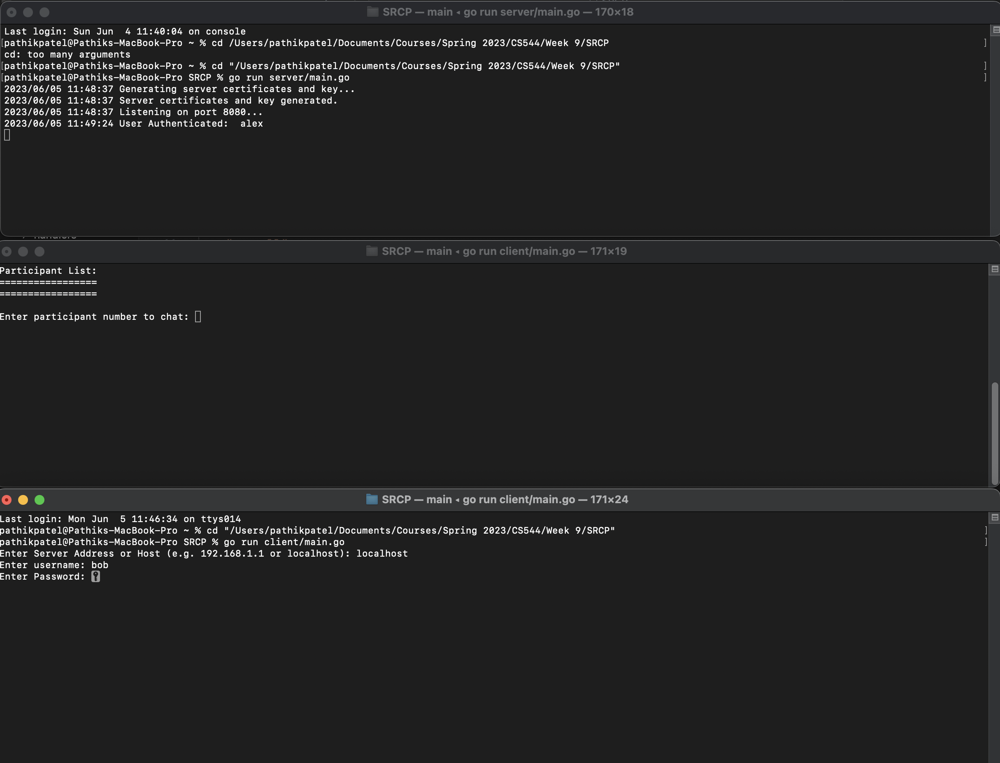
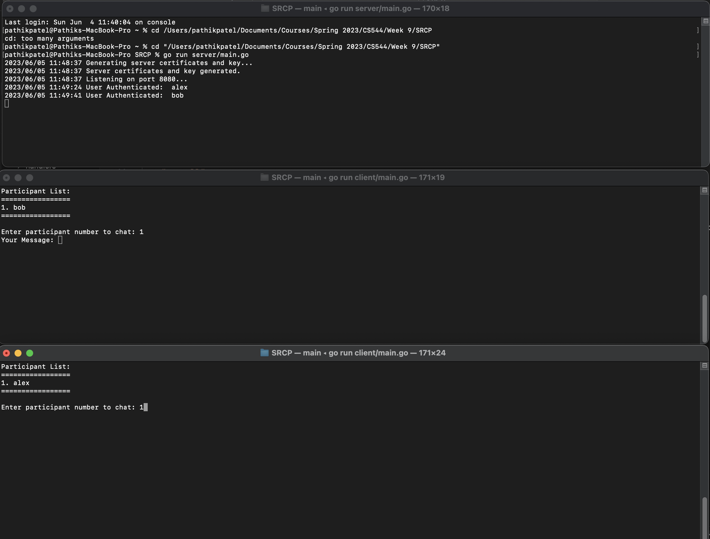
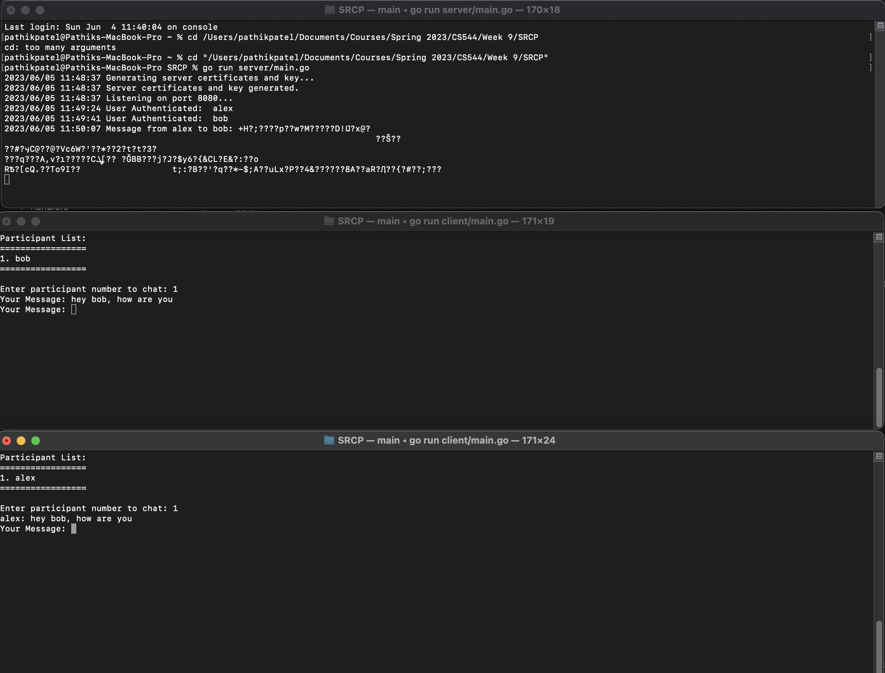
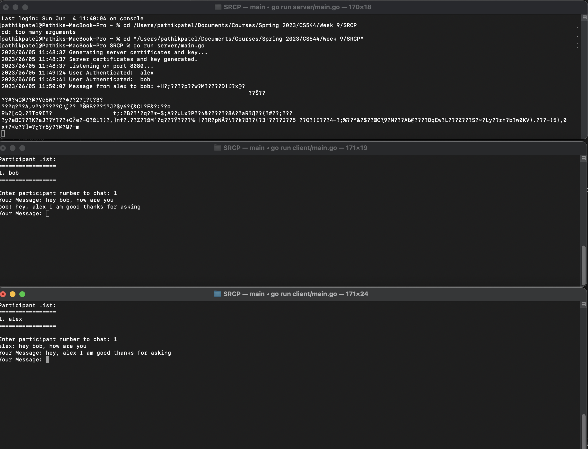
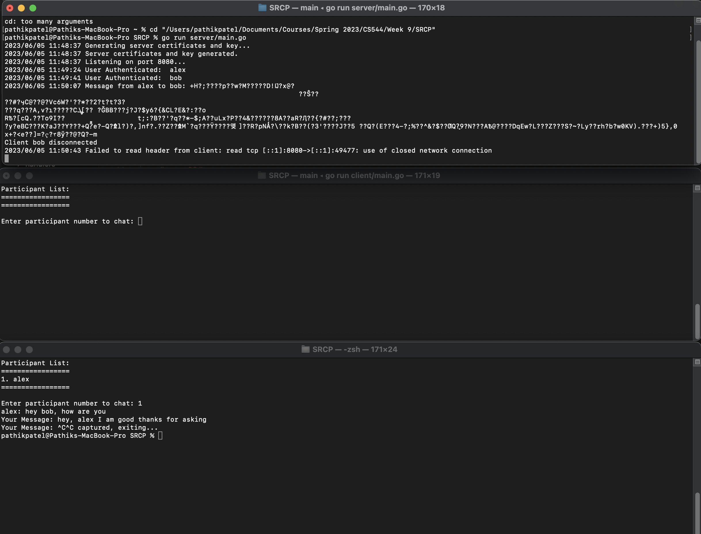

### Steps to run tests:-
1. Open 3 terminal windows and change directory to this project folder.
2. In first terminal start server using 'go run server/main.go'
3. In second and third terminal start client using 'go run client/main.go'
4. Type server address in both client terminals. e.g. (localhost or 192.168.1.100 etc. Address of the server you are running server code)
5. In second and third window type username "alex" and random password. Password checking is not enabled so any random text password will work.
6. In third window type username "bob" and random password.
7. In Second and Third window, Online participants list will be displayed.
8.  Select Participant by typing 1 in both the windows.
9.  Now type messages in second and third terminal windows, message will be transmitted to other user using end to end encryption.
10. Server will also display message in encrypted form.

### Extra credit tasks done:-
1. Implementation Robustness: Complete implementation of the proposed design
2. Concurrent Server: It has a concurrent server with multithreading using go routines and channels
3. Using a Systems Programming Language: Used a golang which is a systems programming language.
4. I needed to update some of the PDUs in the original design. Updated original design document is also attached in folder "design".
5. Working with a cloud-based git-based system such as GitHub

### Demo snapshots

